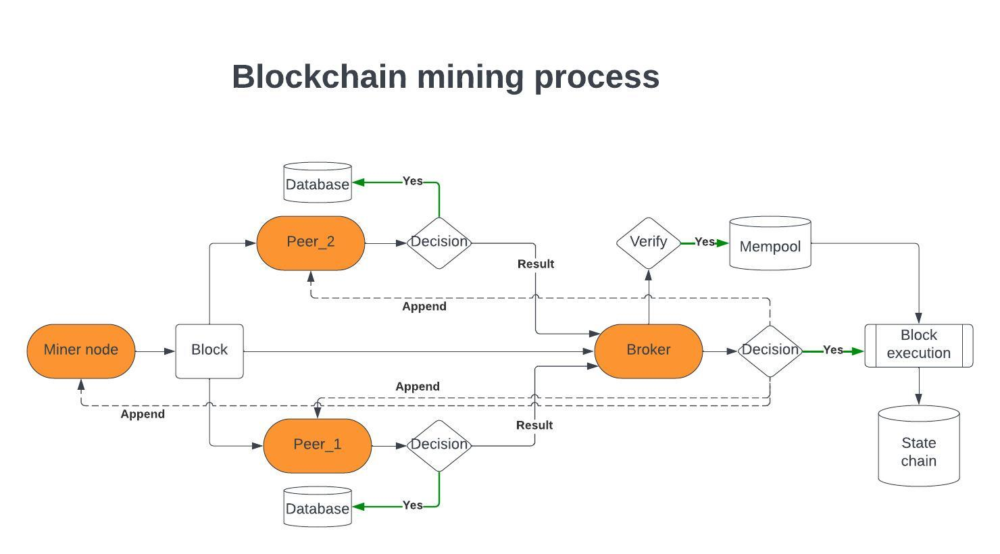

# Blockchain Broker (Roteala Broker)

## Overview

**Blockchain Broker**, known as **Roteala Broker**, It seamlessly performs essential roles such as acting as a seeder for newpeers, serving as an API endpoint for blockchain explorers, and functioning as an interface for wallets to conduct transactions between addresses.

## Mining Process

The mining process in the Roteala Broker ecosystem can be described in a series of systematic steps:

1. **Reception of Pseudo Transactions**: Nodes in the network receive new pseudo transactions.
2. **Validation and Mempool Addition**: After the preliminary validation, these transactions are added to the individual node's local mempool.
3. **Block Mining Initiation**: Nodes commence the process of mining a new block.
4. **Block Header Broadcast**: Upon successful mining of a block, its header is broadcasted to all connected peers and the broker.
5. **Header Validation by Peers**: Peers distinct from the original miner undertake the validation of the received block header.
6. **Confirmation Communication**: Once a peer validates the header, it communicates a confirmation of the header's validity to the broker.
7. **Consensus Check**: The broker, acting as a centralized authority, awaits until confirmations are received from more than 50% of the total network peers.
8. **Header Append Order**: Upon achieving the necessary consensus, the broker issues a directive to append the new header.
9. **Block Creation & State Chain Addition**: Leveraging the header, each node crafts the corresponding block and integrates it into their state chain.
10. **Execution of Funds Movement**: Concurrently, as blocks are added, the associated fund movements (transactions) encapsulated within those blocks are executed.

## Author

- Rotaru "Roti" Andrei(rotaru.andrei98@gmail.com)

